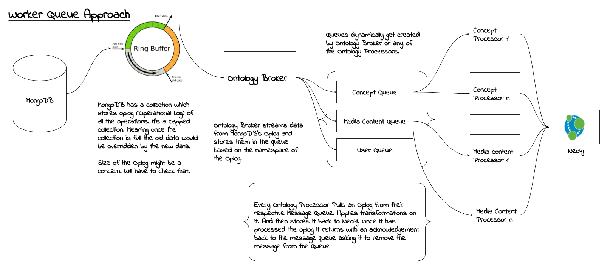

## Stackroute Online Ontology Manager - Worker Queue

### Approach


TODO: Write more detailed instructions to run the code.

### Running Node Factory Seperately ###

Remain in the context of SRO-ONTOLOGY-MANAGER and execute the following command.
```
docker build -t node_factory -f ontology_processors_neo4j/node_factory/Dockerfile .
```

#### Why to remain in the context of SRO-ONTOLOGY-MANAGER? ####

All the utils like neo4j_utils, amqp_utils, sro_utils, are present in the SRO-ONTOLOGY-MANAGER and a symlinks is created in the node-factory, relation-factory and other Microservices.