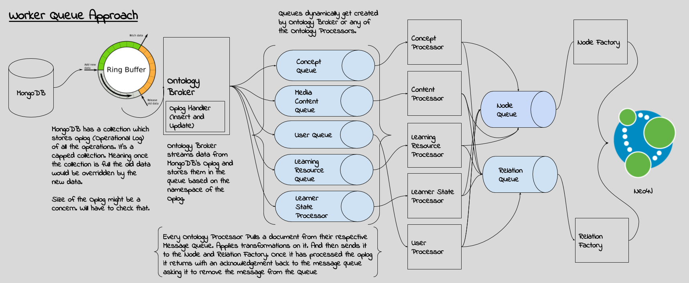

# Stackroute Online Ontology Manager - Worker Queue  
[](https://travis-ci.org/nishant-jain-94/sro-ontology-manager) [](https://coveralls.io/github/nishant-jain-94/sro-ontology-manager?branch=dev-mq-ui-refactor)


### Approach ###


## Prerequisites ##

1. Docker (Version 1.12.6, build 78d1802 while in development)
2. Docker-Compose (Version 1.9.0, build 2585387 while in development)
3. Bash Shell if on Windows. You are good to go if you are on linux.
4. Place the mongodump in the current folder named as `dump`.
5. List of ports to be free:
    
    5.1 Would require port `7474` and `7687` to run Neo4j
    
    5.2 Would require port `5672` and `15672` to run RabbitMQ. `15672` is to run RabbitMQ Management Interface.

    5.3 Would require port `27017` and `28017` to run MongoDB.

    5.4 TODO: List other ports of application.

6. TODO: Adding a Vagrant Box meeting all the requirements.
## Running Ontology Manager ##

```
# Install dependencies across all the modules
yarn run install

# Build and run all the services
docker-compose up --build -d
```